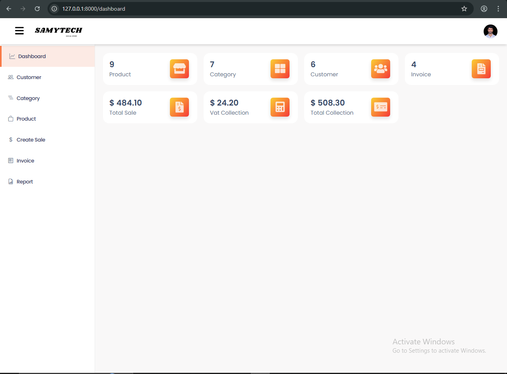
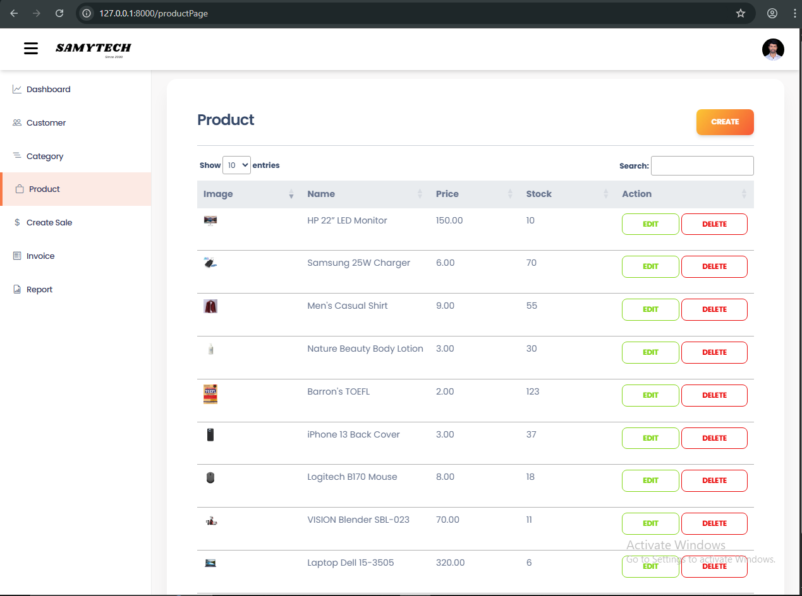
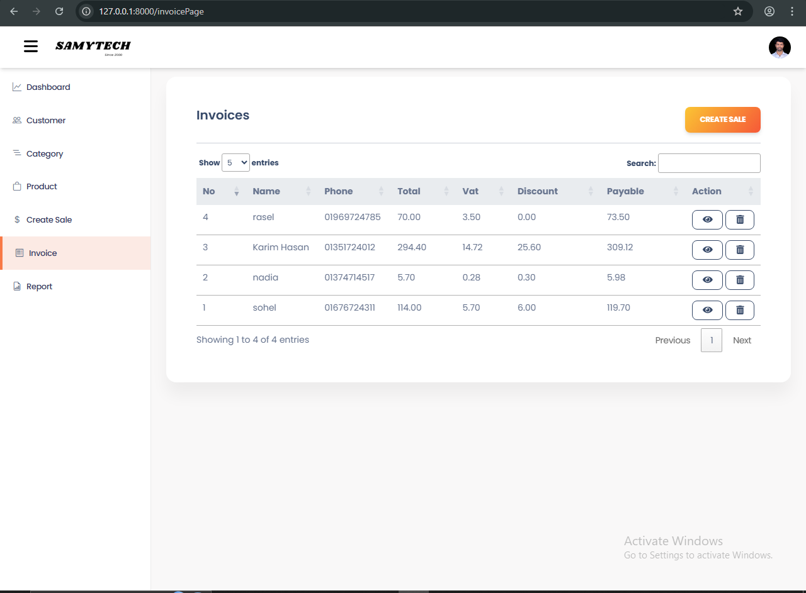
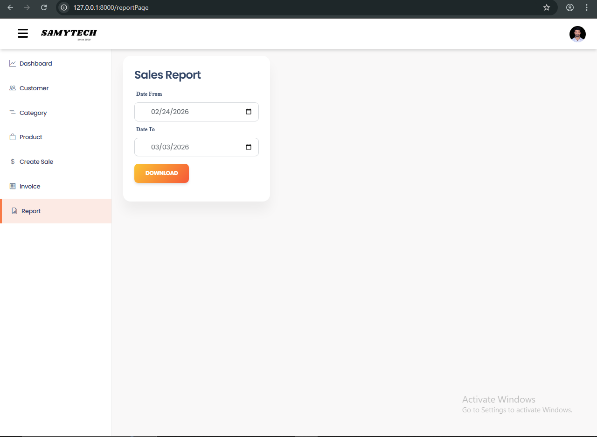

# Laravel Inventory Management System (JWT Auth)  


A scalable Inventory Management System built with Laravel for efficiently managing products, customers, and sales via secure JWT-based API authentication.  

This project demonstrates a real-world backend system suitable for business automation and REST API–driven applications.  

---

## 📸 Screenshots  

### 1️⃣ Dashboard Overview  
  

### 2️⃣ Product Management (CRUD)  
  

### 3️⃣ Invoice / Sales Creation  
  

### 4️⃣ Sales Report (Date Range Filter)  
  

---  

## 🔐 Authentication (JWT)  

API requests require a JWT token in headers.  
```http
Authorization: Bearer your_jwt_token
```
Features include:  
- User registration  
- Login  
- OTP verification (for account confirmation)  
- Password reset  

---

## 🚀 Key Features  
- Secure JWT authentication for API access  
- Role-based user management (Admin / User)  
- Customer management (name, phone, email)  
- Product and category management  
- Inventory and sales tracking  
- PDF invoice generation with customer & product details  
- Daily, weekly, and monthly sales reports  
- RESTful API architecture  
- Input validation and structured error handling  

---

## ⚙️ Tech Stack  
- Laravel  
- PHP  
- MySQL  
- JWT Authentication  
- REST API  
- MVC Architecture  

---

## API Modules  

- Authentication (Login / Register)  
- Users & Roles  
- Customers  
- Products  
- Categories  
- Inventory / Stock  
- Sales & Reports  
- Invoices (PDF)  

## Installation & Setup  

```bash  
git clone https://github.com/sohelsamy1/Laravel-Inventory.git  
cd Laravel-Inventory  
composer install  
cp .env.example .env  
php artisan key:generate  
php artisan migrate  
php artisan serve  

```  
## 🧪 API Testing  

You can test the API using:  
- Postman  
- Insomnia  
- Thunder Client (VS Code)  


## 🔗 Live Demo  

- Live demo will be added soon.  


## 👤 Author

**Sohel Samy**   
Laravel | Vue | React Developer  
GitHub: [sohelsamy1](https://github.com/sohelsamy1)  
LinkedIn: [linkedin.com/in/sohelsamy](https://linkedin.com/in/sohelsamy)  
